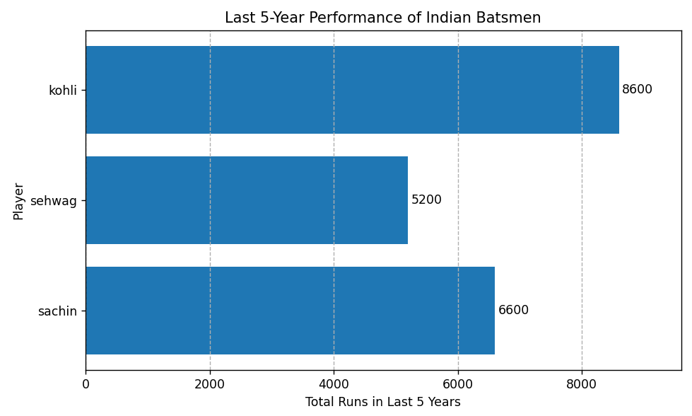

# players-5-years-performance-data-with-matplotlib
Showing players 5 years performance data with matplotlib

- In this program we have (sachin, sehwag, kohli) last 10 years run data.
- And we can analyse the last 5 years performance of every player.

- we can use numpy for data cleaning and use matplotlib for data visualisation.

## This is the final Data with good visualisation.

